# REQUIRE-X: Multi-Agent AI Framework for Intelligent Software Requirement Engineering

[](https://www.python.org/)
[](https://standards.ieee.org/ieee/29148/7133/)
[](https://streamlit.io/)
[](LICENSE)

**REQUIRE-X** is an end-to-end Multi-Agent AI Framework designed to automate, analyze, audit, and transform Software Requirement Specification (SRS) documents into rigorous, publication-grade engineering artifacts.

---

## 📌 Project Overview
* **Student Name:** Rose Mariya Paul
* **Class:** MCA S3 | **Roll/Reg No:** TCR25MCA-2045
* **Department:** Department of Computer Applications
* **Institution:** Government Engineering College, Thrissur, Kerala
* **Guide:** Maria Sofia S

---

## 🏗️ System Architecture & Multi-Agent Workflow

```mermaid
graph TD
    User([User / Requirement Engineer]) -->|Upload PDF, DOCX, TXT| Ingestion[Requirement Ingestion & Parsing Module]
    Ingestion --> Coordinator[Coordinator / Orchestrator Agent]
    
    Coordinator --> Agent1[1. Extraction & Classification Agent]
    Agent1 -->|Structured FRs & NFRs| Agent2[2. Ambiguity Detection Agent]
    Agent1 -->|Structured Requirements| Agent3[3. Dependency Analysis Agent]
    Agent1 -->|Structured Requirements| Agent4[4. ISO/IEC/IEEE 29148 Compliance Agent]
    
    Agent1 & Agent4 --> Agent5[5. Traceability & Architecture Agent]
    Agent1 & Agent2 --> Agent6[6. Test Case Generation Agent]
    
    Agent1 & Agent2 & Agent3 & Agent4 & Agent5 & Agent6 --> Agent7[7. Engineering Report Generation Agent]
    
    Agent7 --> UI[Interactive Web UI & Visualization Dashboard]
    Agent7 --> PDF[Professional PDF Engineering Report]
    Agent7 --> Exports[JSON / CSV / Markdown Artifacts]
```



---

## 🤖 Specialized AI Agents

1. **Coordinator / Orchestrator Agent**:
   - Manages pipeline execution, telemetry, error handling, and multi-agent consensus.
2. **Requirement Extraction & Classification Agent**:
   - Parses atomic requirements with unique IDs (`FR-001`, `NFR-001`, etc.).
   - Classifies Functional (FR) vs Non-Functional Requirements (NFR) and sub-categories (Security, Performance, Reliability, Usability, Maintainability, Scalability, Portability).
   - Estimates implementation complexity (Low/Medium/High) and Agile story points.
3. **Ambiguity Detection Agent**:
   - Detects vague words (*"fast"*, *"user-friendly"*, *"robust"*, *"as appropriate"*, *"sufficient"*), passive voice without actors, and untestable qualifiers.
   - Proposes ISO-compliant, quantifiable rewrites.
4. **Dependency Analysis Agent**:
   - Maps inter-requirement relationships (`depends_on`, `conflicts_with`, `extends`, `triggers`, `constrains`).
   - Generates interactive Mermaid and topological network graphs.
5. **Standards Compliance Validation Agent (ISO/IEC/IEEE 29148:2018)**:
   - Evaluates requirements against all 9 standard quality characteristics (*Completeness, Consistency, Correctness, Unambiguity, Verifiability, Modifiability, Traceability, Feasibility, Necessity*).
   - Computes overall compliance score (0–100%) and letter grade.
6. **Traceability & Architecture Recommendation Agent**:
   - Recommends optimal software architecture patterns (*Event-Driven Microservices, Clean/Hexagonal Architecture, Modular Monolith, CQRS*) based on NFR constraints.
   - Generates component breakdowns and architectural Mermaid diagrams.
   - Generates the bidirectional Requirements Traceability Matrix (RTM).
7. **Test Case Generation Agent**:
   - Automatically generates positive functional, boundary/edge-case, security, and performance test suites mapped to requirement IDs.
8. **Engineering Report Generation Agent**:
   - Compiles formal ReportLab PDF reports, machine-readable JSON, CSV, and Markdown exports.

---

## 🚀 Quick Start Guide

### 1. Installation
```bash
# Clone the repository
git clone https://github.com/your-username/REQUIRE-X.git
cd MultiAgentAIFrameworkForIntelligentSoftwareRE

# Install dependencies
pip install -r requirements.txt
```

### 2. Launch the Application
```bash
streamlit run app.py
```
Open your browser at `http://localhost:8501`.

### 3. Run Automated Unit Tests
```bash
python -m unittest discover tests
```

---

## 📦 Supported Input Formats
- **PDF Documents** (`.pdf`) via PyMuPDF
- **Microsoft Word Documents** (`.docx`) via `python-docx`
- **Plain Text & Markdown** (`.txt`, `.md`)

---

## 🛡️ Standards Compliance
REQUIRE-X directly implements the **ISO/IEC/IEEE 29148:2018** Systems and Software Engineering — Life Cycle Processes — Requirements Engineering standard.

---

## 📄 License
This project is licensed under the MIT License.
