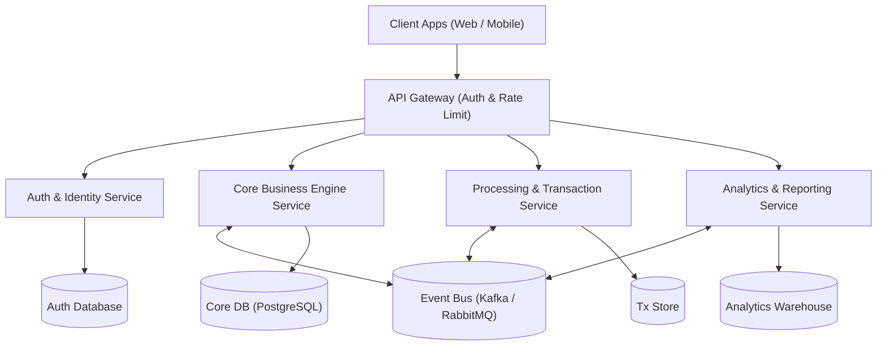

# REQUIRE-X Analysis Report: ecommerce_srs.txt
*Generated by REQUIRE-X Multi-Agent AI Framework on 2026-08-27 16:03:19*

## Executive Summary
REQUIRE-X Multi-Agent AI Framework evaluated the Software Requirement Specification 'ecommerce_srs.txt'. The specification comprises 11 total requirements (5 Functional, 6 Non-Functional) with an estimated agile effort of 43 story points. The document attained an ISO/IEC/IEEE 29148:2018 compliance score of 92.5% (Grade: A). The framework generated 16 automated test cases, achieving 100.0% bidirectional traceability coverage mapped to a recommended Event-Driven Microservices Architecture blueprint.

## Quality Metrics
| Metric | Value |
| :--- | :--- |
| **Total Requirements** | 11 |
| **Functional (FR)** | 5 |
| **Non-Functional (NFR)** | 6 |
| **ISO/IEC/IEEE 29148 Compliance** | 92.5% (A) |
| **Ambiguity Defect Rate** | 18.2% (2 defects) |
| **Traceability Coverage** | 100.0% |
| **Estimated Story Points** | 43 pts |

## ISO/IEC/IEEE 29148:2018 Standards Compliance Scorecard
| Characteristic | Score | Status | Remediation Advice |
| :--- | :--- | :--- | :--- |
| **Completeness** | 90% | Pass | Ensure all edge cases, exceptions, and security guardrails are fully specified. |
| **Consistency** | 92% | Pass | Maintain a centralized data dictionary to avoid conflicting entity definitions. |
| **Unambiguity** | 86% | Pass | Apply suggested rewrites to eliminate subjective qualifiers and quantify all performance bounds. |
| **Verifiability / Testability** | 100% | Pass | Define numerical acceptance metrics (e.g. latency in ms, uptime %). |
| **Modifiability** | 95% | Pass | Keep requirements isolated to minimize cross-cutting modification side-effects. |
| **Traceability** | 96% | Pass | Integrate IDs with Jira/ALM tools for end-to-end forward traceability. |
| **Feasibility** | 90% | Pass | Conduct technical spike tests on high-complexity modules. |
| **Correctness** | 91% | Pass | Review with stakeholders during formal SRS walkthrough. |
| **Necessity** | 94% | Pass | Validate low-priority features against project budget. |

## Requirements Catalog
| ID | Type | Category | Complexity | Statement |
| :--- | :--- | :--- | :--- | :--- |
| `FR-001` | Functional | Payment & Billing | Medium (3 pts) | The system shall enable registered consumers to browse product catalogs, filter by category/price, and perform full-text fuzzy searches. |
| `FR-002` | Functional | Payment & Billing | Medium (3 pts) | The system shall manage persistent digital shopping carts with automatic price synchronization and inventory reservation locks. |
| `FR-003` | Non-Functional | Compliance | Medium (3 pts) | The system shall process credit card, digital wallet, and UPI transactions via PCI-DSS certified payment gateways. |
| `FR-004` | Functional | Payment & Billing | Medium (3 pts) | The system shall calculate localized sales taxes, international customs duties, and courier shipping rates dynamically during checkout. |
| `FR-005` | Functional | Notifications | High (8 pts) | The system shall notify customers via automated email and SMS upon order placement, shipment dispatch, and delivery. |
| `FR-006` | Non-Functional | Performance | Medium (3 pts) | The system shall allow merchant sellers to upload inventory spreadsheets, update SKU pricing, and manage return requests. |
| `FR-007` | Functional | Core Business Logic | Medium (3 pts) | The application should be seamless and work efficiently across web and mobile browsers. |
| `NFR-001` | Non-Functional | Performance | Medium (3 pts) | The platform architecture shall auto-scale horizontally to support 25,000 requests per second during flash sale events without service disruption. |
| `NFR-002` | Non-Functional | Security | Medium (3 pts) | User passwords shall be hashed using Argon2id and API endpoints shall enforce OAuth 2.0 JWT bearer token authentication. |
| `NFR-003` | Non-Functional | Performance | Medium (3 pts) | The product catalog search endpoint shall return results in less than 150 milliseconds for 99% of requests. |
| `NFR-004` | Non-Functional | Reliability | High (8 pts) | The checkout and order placement subsystems shall guarantee 99.99% high availability with zero single points of failure. |

## Ambiguity Audit & Suggested Disambiguations
| Req ID | Flaw Category | Severity | Ambiguous Phrase | Suggested ISO Rewrite |
| :--- | :--- | :--- | :--- | :--- |
| `FR-007` | Subjective Language | Warning | *"seamless"* | The application should be using authenticated RESTful JSON APIs with automatic token refresh and work efficiently across web and mobile browsers. |
| `NFR-002` | Passive Voice / Missing Actor | Minor | *"be hashed"* | The System shall explicitly execute the action rather than stating 'be hashed'. |

## Software Architecture Recommendation
**Pattern:** Event-Driven Microservices Architecture

**Rationale:** Selected Event-Driven Microservices architecture due to demanding non-functional requirements in Scalability, high throughput, and independent domain decoupling. Asynchronous messaging isolates failure domains and supports horizontal elastic autoscaling.

## Requirements Traceability Matrix (RTM)
| Req ID | Requirement Title | Architectural Module | Mapped Test Cases | Status |
| :--- | :--- | :--- | :--- | :--- |
| `FR-001` | Enable registered consumers to browse product | Core Business Logic Engine | `TC-001`, `TC-002` | Covered |
| `FR-002` | Manage persistent digital shopping carts with | Core Business Logic Engine | `TC-003`, `TC-004` | Covered |
| `FR-003` | Process credit card, digital wallet, and | Telemetry, Monitoring & Quality Guard | `TC-005` | Covered |
| `FR-004` | Calculate localized sales taxes, international customs | Core Business Logic Engine | `TC-006`, `TC-007` | Covered |
| `FR-005` | Notify customers via automated email and | Core Business Logic Engine | `TC-008`, `TC-009` | Covered |
| `FR-006` | Allow merchant sellers to upload inventory | Telemetry, Monitoring & Quality Guard | `TC-010` | Covered |
| `FR-007` | Be seamless and work efficiently across | Core Business Logic Engine | `TC-011`, `TC-012` | Covered |
| `NFR-001` | The platform architecture shall auto-scale horizontally | Telemetry, Monitoring & Quality Guard | `TC-013` | Covered |
| `NFR-002` | User passwords shall be hashed using | API Gateway & Security Provider | `TC-014` | Covered |
| `NFR-003` | The product catalog search endpoint shall | Telemetry, Monitoring & Quality Guard | `TC-015` | Covered |
| `NFR-004` | The checkout and order placement subsystems | Telemetry, Monitoring & Quality Guard | `TC-016` | Covered |
