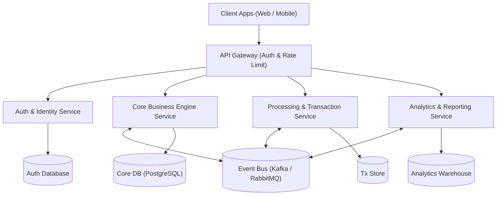

# REQUIRE-X Analysis Report: healthcare_srs.txt
*Generated by REQUIRE-X Multi-Agent AI Framework on 2026-08-27 16:03:19*

## Executive Summary
REQUIRE-X Multi-Agent AI Framework evaluated the Software Requirement Specification 'healthcare_srs.txt'. The specification comprises 16 total requirements (8 Functional, 8 Non-Functional) with an estimated agile effort of 73 story points. The document attained an ISO/IEC/IEEE 29148:2018 compliance score of 84.2% (Grade: B+). The framework generated 24 automated test cases, achieving 100.0% bidirectional traceability coverage mapped to a recommended Event-Driven Microservices Architecture blueprint.

## Quality Metrics
| Metric | Value |
| :--- | :--- |
| **Total Requirements** | 16 |
| **Functional (FR)** | 8 |
| **Non-Functional (NFR)** | 8 |
| **ISO/IEC/IEEE 29148 Compliance** | 84.2% (B+) |
| **Ambiguity Defect Rate** | 50.0% (8 defects) |
| **Traceability Coverage** | 100.0% |
| **Estimated Story Points** | 73 pts |

## ISO/IEC/IEEE 29148:2018 Standards Compliance Scorecard
| Characteristic | Score | Status | Remediation Advice |
| :--- | :--- | :--- | :--- |
| **Completeness** | 90% | Pass | Ensure all edge cases, exceptions, and security guardrails are fully specified. |
| **Consistency** | 92% | Pass | Maintain a centralized data dictionary to avoid conflicting entity definitions. |
| **Unambiguity** | 60% | Fail | Apply suggested rewrites to eliminate subjective qualifiers and quantify all performance bounds. |
| **Verifiability / Testability** | 70% | Warning | Define numerical acceptance metrics (e.g. latency in ms, uptime %). |
| **Modifiability** | 95% | Pass | Keep requirements isolated to minimize cross-cutting modification side-effects. |
| **Traceability** | 96% | Pass | Integrate IDs with Jira/ALM tools for end-to-end forward traceability. |
| **Feasibility** | 90% | Pass | Conduct technical spike tests on high-complexity modules. |
| **Correctness** | 91% | Pass | Review with stakeholders during formal SRS walkthrough. |
| **Necessity** | 94% | Pass | Validate low-priority features against project budget. |

## Requirements Catalog
| ID | Type | Category | Complexity | Statement |
| :--- | :--- | :--- | :--- | :--- |
| `FR-001` | Functional | Core Business Logic | Medium (3 pts) | The system shall ## Project: SmartCare Hospital & Clinical Patient Management System |
| `FR-002` | Functional | Payment & Billing | High (8 pts) | The system shall the SmartCare System is an integrated hospital clinical information management platform designed to automate patient intake, electronic health records (EHR), physician prescription management, billing, and real-time medical vital alerts. |
| `FR-001` | Functional | User Management & Auth | High (8 pts) | The system shall allow authorized hospital staff and triage nurses to register new patients with demographic details, government health IDs, and insurance policies. |
| `FR-002` | Functional | User Management & Auth | Medium (3 pts) | The system shall factor authentication mechanism for doctors, nurses, and administrative staff using role-based access control. |
| `FR-003` | Functional | Core Business Logic | Medium (3 pts) | The system shall allow licensed physicians to create, review, and digitally sign electronic prescriptions and laboratory test orders. |
| `FR-004` | Non-Functional | Maintainability | Medium (3 pts) | The system shall record continuous ICU vital telemetry (heart rate, SpO2, blood pressure) and trigger visual and SMS alerts to on-duty staff when vitals exceed clinical safety thresholds. |
| `FR-005` | Functional | Payment & Billing | Medium (3 pts) | The system shall payment amounts. |
| `FR-006` | Functional | Payment & Billing | High (8 pts) | The system shall generate comprehensive daily discharge summaries and invoice billing statements in PDF format. |
| `FR-007` | Non-Functional | Usability | Medium (3 pts) | The system shall provide an intuitive dashboard for ward bed occupancy tracking and automatic room assignment. |
| `FR-008` | Non-Functional | Performance | Medium (3 pts) | The system shall process patient search queries fast and return medical history with minimal delay. |
| `FR-009` | Functional | Core Business Logic | Medium (3 pts) | The system shall be robust and handle high hospital data traffic as appropriate. |
| `NFR-001` | Non-Functional | Security | Medium (3 pts) | All patient electronic protected health information (ePHI) shall be encrypted at rest using AES-256 and in transit using TLS 1.3 in compliance with HIPAA guidelines. |
| `NFR-002` | Non-Functional | Performance | Medium (3 pts) | The system shall process API transactions with a 95th percentile response latency of under 400 milliseconds under a concurrent load of 500 active clinicians. |
| `NFR-003` | Non-Functional | Performance | High (8 pts) | The hospital management system shall maintain a minimum service availability of 99.95% uptime with automated database failover within 30 seconds. |
| `NFR-004` | Non-Functional | Usability | Medium (3 pts) | The user interface shall be user-friendly, clean, and easy to use for medical staff on desktop tablets and workstation monitors. |
| `NFR-005` | Non-Functional | Maintainability | High (8 pts) | The system shall maintain comprehensive structured audit logging for all patient record access events with 7-year immutable archival. |

## Ambiguity Audit & Suggested Disambiguations
| Req ID | Flaw Category | Severity | Ambiguous Phrase | Suggested ISO Rewrite |
| :--- | :--- | :--- | :--- | :--- |
| `FR-005` | Incomplete Specification | Warning | *"The system shall payment amounts."* | The system shall payment amounts with specific input validation parameters and return status codes. |
| `FR-008` | Unquantified Metric | Warning | *"fast"* | The system shall process patient search queries within 250 milliseconds under peak concurrent load of 1,000 requests/sec and return medical history with minimal delay. |
| `FR-008` | Unquantified Metric | Warning | *"minimal delay"* | The system shall process patient search queries fast and return medical history with within a maximum threshold of 100 milliseconds. |
| `FR-009` | Vagueness / Weak Words | Warning | *"robust"* | The system shall be fault-tolerant with automated retry logic and 99.95% error-free transaction processing and handle high hospital data traffic as appropriate. |
| `FR-009` | Incomplete Specification | Critical | *"as appropriate"* | The system shall be robust and handle high hospital data traffic upon detecting a validated user trigger event. |
| `NFR-001` | Passive Voice / Missing Actor | Minor | *"be encrypted"* | The System shall explicitly execute the action rather than stating 'be encrypted'. |
| `NFR-004` | Subjective Language | Warning | *"user-friendly"* | The user interface shall be conformant with WCAG 2.1 AA guidelines and enabling task completion in <= 3 user clicks, clean, and easy to use for medical staff on desktop tablets and workstation monitors. |
| `NFR-004` | Subjective Language | Warning | *"easy to use"* | The user interface shall be user-friendly, clean, and conformant with WCAG 2.1 AA guidelines and enabling task completion in <= 3 user clicks for medical staff on desktop tablets and workstation monitors. |

## Software Architecture Recommendation
**Pattern:** Event-Driven Microservices Architecture

**Rationale:** Selected Event-Driven Microservices architecture due to demanding non-functional requirements in Scalability, high throughput, and independent domain decoupling. Asynchronous messaging isolates failure domains and supports horizontal elastic autoscaling.

## Requirements Traceability Matrix (RTM)
| Req ID | Requirement Title | Architectural Module | Mapped Test Cases | Status |
| :--- | :--- | :--- | :--- | :--- |
| `FR-001` | ## project: smartcare hospital & clinical | API Gateway & Security Provider | `TC-001`, `TC-002`, `TC-005`, `TC-006` | Covered |
| `FR-002` | The smartcare system is an integrated | API Gateway & Security Provider | `TC-003`, `TC-004`, `TC-007`, `TC-008` | Covered |
| `FR-001` | Allow authorized hospital staff and triage | API Gateway & Security Provider | `TC-001`, `TC-002`, `TC-005`, `TC-006` | Covered |
| `FR-002` | Factor authentication mechanism for doctors, nurses, | API Gateway & Security Provider | `TC-003`, `TC-004`, `TC-007`, `TC-008` | Covered |
| `FR-003` | Allow licensed physicians to create, review, | Core Business Logic Engine | `TC-009`, `TC-010` | Covered |
| `FR-004` | Record continuous icu vital telemetry (heart | Telemetry, Monitoring & Quality Guard | `TC-011` | Covered |
| `FR-005` | Payment amounts | Core Business Logic Engine | `TC-012`, `TC-013` | Covered |
| `FR-006` | Generate comprehensive daily discharge summaries and | Core Business Logic Engine | `TC-014`, `TC-015` | Covered |
| `FR-007` | Provide an intuitive dashboard for ward | Telemetry, Monitoring & Quality Guard | `TC-016` | Covered |
| `FR-008` | Process patient search queries fast and | Telemetry, Monitoring & Quality Guard | `TC-017` | Covered |
| `FR-009` | Be robust and handle high hospital | Core Business Logic Engine | `TC-018`, `TC-019` | Covered |
| `NFR-001` | All patient electronic protected health information | Data Management & Persistence Service | `TC-020` | Covered |
| `NFR-002` | Process api transactions with a 95th | Telemetry, Monitoring & Quality Guard | `TC-021` | Covered |
| `NFR-003` | The hospital management system shall maintain | Telemetry, Monitoring & Quality Guard | `TC-022` | Covered |
| `NFR-004` | The user interface shall be user-friendly, | Telemetry, Monitoring & Quality Guard | `TC-023` | Covered |
| `NFR-005` | Maintain comprehensive structured audit logging for | Telemetry, Monitoring & Quality Guard | `TC-024` | Covered |
